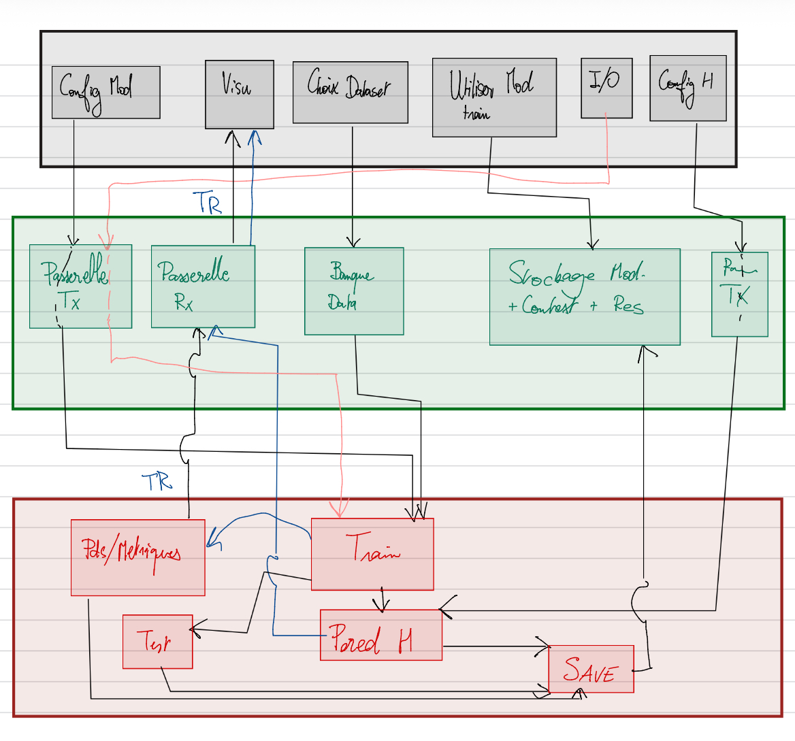

# PROJET_GL

Voici le logo du projet 👇  

Ce projet contient le code source du module principal.
export KMP_DUPLICATE_LIB_OK=TRUEDD
export OMP_NUM_THREADS=1
python -m uvicorn SERVEUR_IA.test_main:app --host 0.0.0.0 --port 8000 --reload

export KMP_DUPLICATE_LIB_OK=TRUEDD
export OMP_NUM_THREADS=1
python -m uvicorn SERVEUR_DATA.main2:app --host 0.0.0.0 --port 8001 --reload