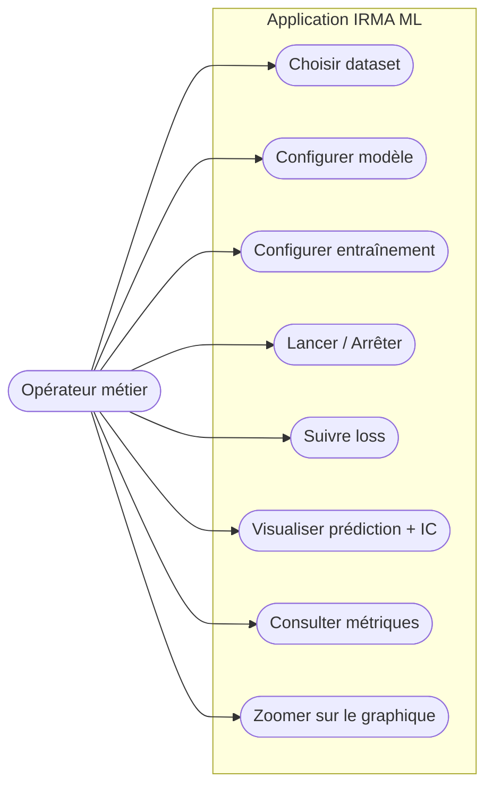
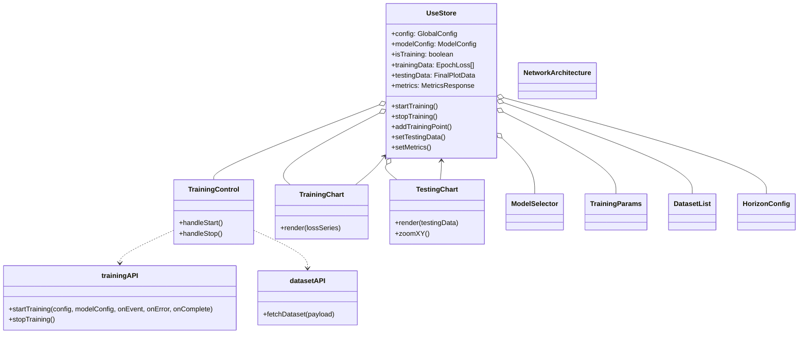
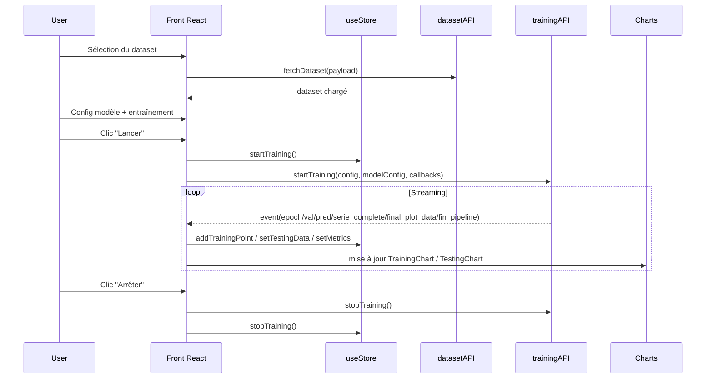

# Cahier des charges – Application de prédiction de ventes

## 1. Contexte et objectifs
- **Utilisateur cible** : entreprises planifiant achats matières premières, recrutement intérimaire, logistique, etc.
- **Objectif métier** : anticiper les ventes pour ajuster les ressources.
- **Objectif produit** : fournir une interface permettant de configurer et d’entraîner des réseaux de neurones sur des séries temporelles, puis de visualiser/évaluer les prédictions.

## 2. Acteurs et cas d’usage principaux
- **Opérateur métier / Data analyst**  
  - Importer/choisir un dataset temporel.  
  - Configurer le modèle (type, architecture).  
  - Configurer l’entraînement (epochs, batch, LR, scheduler).  
  - Lancer/stopper un entraînement.  
  - Suivre la courbe de perte en live.  
  - Visualiser prédictions, intervalles de confiance, métriques (validation/test).  
  - Ajuster la fenêtre de visualisation (zoom X/Y) pour analyser une zone.
- **Administrateur technique (optionnel)**  
  - Surveiller la bonne exécution du backend ML (non couvert ici).

## 3. Périmètre fonctionnel
- **Gestion des données**
  - Sélection d’un dataset existant (nom, dates, pas temporel, découpage train/val/test).
  - Chargement du dataset via API `datasetAPI.fetchDataset`.
- **Configuration du modèle**
  - Choix du type de réseau (MLP, LSTM, CNN).
  - Paramétrage architecture (couches, hidden_size, dropout, activation…).
  - Choix de la fonction de perte (MSE/MAE/Huber).
  - Choix de l’optimiseur (Adam, SGD, RMSprop, Adagrad, Adadelta).
  - Scheduler (None, Plateau, Cosine, OneCycle), patience (si Plateau).
- **Entraînement**
  - Paramètres d’entraînement : nb_epochs, batch_size, clip_gradient.
  - Démarrage/arrêt manuel.
  - Réception d’événements streaming : `epoch`, `val_*`, `pred_*`, `serie_complete`, `final_plot_data`, `fin_pipeline`.
- **Visualisation & analyse**
  - Courbe de perte (TrainingChart).
  - Graphique de test (TestingChart) : série réelle, validation, prédiction autorégressive, intervalles de confiance.
  - Références visuelles sur les index de début validation/test.
  - Tooltip formaté, légende, brush X natif.
  - Zoom manuel X/Y par rectangle (Shift + drag) et reset (double-clic).
- **Métriques**
  - Affichage des métriques validation/prédiction reçues des événements (`val_metrics`, `pred_metrics`, `val_end`, `pred_end`).
  - Agrégation dans le store global (`useStore`).

## 4. Exigences non fonctionnelles
- **Compatibilité** : Web moderne + cible Electron (packaging prévu).  
- **Performance** : affichage réactif pour datasets courts/moyens (pas de contrainte forte précisée).  
- **Fiabilité** : gérer les erreurs d’API (alertes affichées), arrêt propre de l’entraînement.  
- **Accessibilité/UX** : interface réactive, feedback visuel (état entraînement, boutons, légendes).  
- **Sécurité** : non spécifiée (projet école, pas d’authentification/autorisation).  
- **Déploiement** : non spécifié (scripts build/preview/electron fournis).

## 5. Données et formats (frontend)
- **Config globale (store)** : `GlobalConfig` avec paramètres temporels, réseau, perte, optimiseur, entraînement, visualisation.
- **Événements d’entraînement** : `epoch`, `val_start/val_pair/val_end`, `pred_start/pred_point/pred_end`, `serie_complete`, `final_plot_data`, `fin_pipeline`.
- **Résultat final (testingData)** : `FinalPlotData` : série complète, prédictions val/test, intervalles (low/high), index de début val/test, métriques val/pred.
- **Métriques** : `MetricsResponse` (validation, prediction, overall_mean).

## 6. Architecture logique (vue haut niveau)
- **Frontend** : React + Zustand (store) + Recharts pour les graphs, Tailwind/clsx pour le style, Electron pour packaging.
- **APIs consommées** : `datasetAPI` (chargement jeu de données), `trainingAPI` (lancement/stop + streaming d’événements).
- **Store** : centralise config, état d’entraînement, données de test, métriques.
- **Composants clés** :
  - `DatasetList` / `HorizonConfig` : sélection et paramétrage des données.
  - `ModelSelector` / `NetworkArchitecture` : choix/paramétrage du modèle.
  - `TrainingParams` : hyperparamètres d’entraînement et optimiseur.
  - `TrainingControl` : boutons start/stop, orchestration des événements.
  - `TrainingChart` : suivi de la loss.
  - `TestingChart` : visualisation des résultats val/test + zoom.

## 7. Flux principaux
1) **Préparation données** : l’utilisateur choisit dataset (nom + dates + pas), déclenche `datasetAPI.fetchDataset`.  
2) **Configuration modèle** : sélection type (MLP/LSTM/CNN) et paramètres; configuration optimiseur/scheduler.  
3) **Entraînement** : clic “Lancer” → `trainingAPI.startTraining` → réception événements → mise à jour du store (loss, métriques, séries).  
4) **Visualisation** : `TrainingChart` affiche la loss; `TestingChart` affiche séries, prédictions, intervalles, métriques; l’utilisateur peut zoomer X/Y.  
5) **Arrêt** : clic “Arrêter” → `trainingAPI.stopTraining` + reset état training.

## 8. Diagrammes UML (mermaid)

### 8.1 Diagramme de cas d’utilisation (acteur opérateur)

### 8.2 Diagramme de classes (vue front logique)

### 8.3 Diagramme de séquence (lancement d’entraînement)

## 9. Hypothèses / limites
- Sécurité, authentification, chiffrement : non couverts (projet école).
- Volumétrie : non définie (tests sur séries de taille modérée).
- Backend ML déjà disponible via `trainingAPI`/`datasetAPI` (non spécifié ici).
- Export / partage des résultats : hors périmètre actuel.

## 10. Livrables attendus
- Présent document `cahier_des_charges/README.md` (textes + diagrammes mermaid).
- Code applicatif (React + Zustand + Recharts + Electron) déjà présent dans le dépôt.
